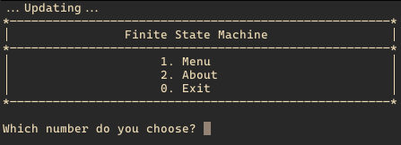
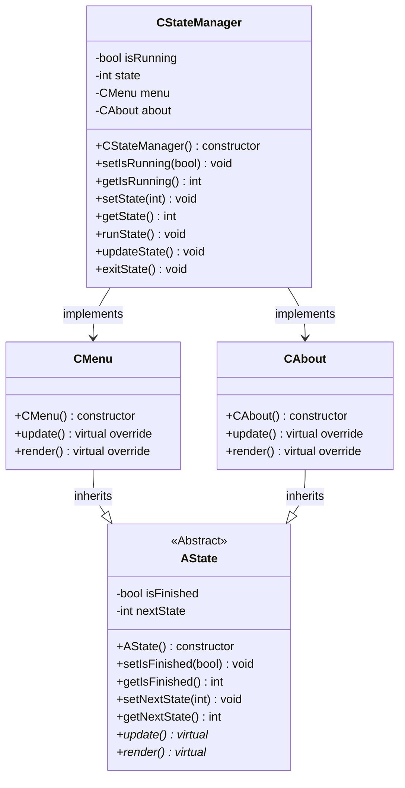
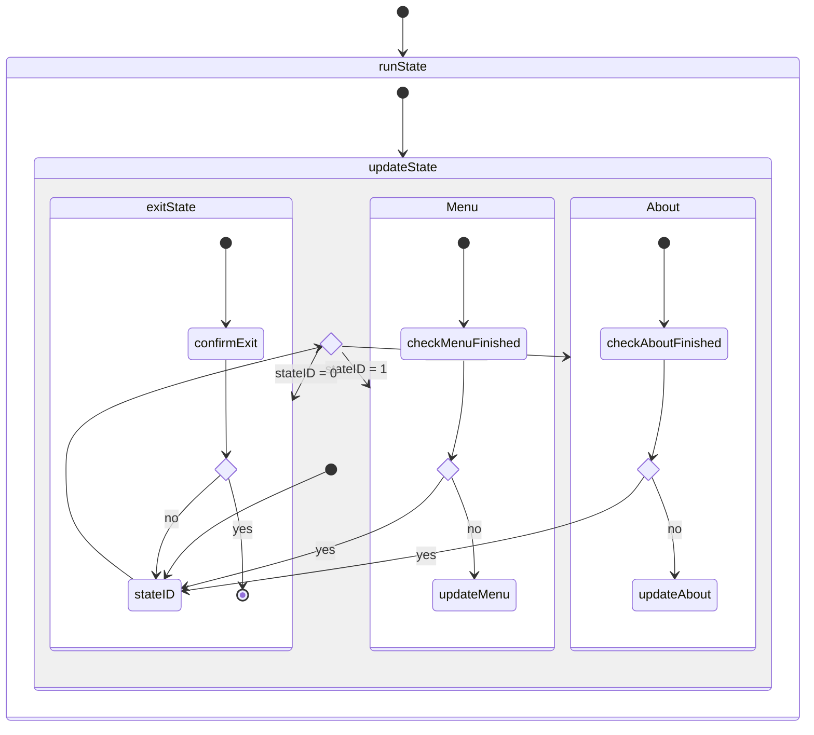

<h1 align="center">Finite State Machine</h1>

> Developed in [GCC](https://gcc.gnu.org/)

<!--  -->
<p align="center">
    
</p>

## Contents

-   [Project Configuration](#1-project-configuration)
-   [Features](#2-features)
-   [Usage](#3-usage)
-   [Class Diagram](#4-class-diagram)
-   [State Diagram](#5-state-diagram)

---

### 1. Project Configuration

-   GCC: 14.0.0

### 2. Features

Navigates between states (`Menu`, `About`, `Exit`).

### 3. Usage

To compile and build the project:

```shell
$ make
```

After that, we can run the project:

```shell
$ make run

# or 

$ ./FSM
```

To clean or rebuild the project:

```shell
$ make clean; make

# or

$ make rebuild
```

### 4. Class Diagram



### 5. State Diagram

